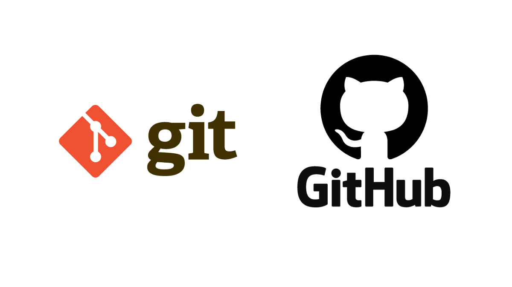

# ¿Que es Git?

Git es un control de versiones creado por Linus Torval el creador del sistema operativo GNU/Linux.

Git es de codigo abierto, es decir que cualquiera puede ver su codigo y hacer la propia version de si mismo o hacerle extensiones como lo es GitHub.

### ¿Qué es GitHub?

> GitHub es una forja para alojar proyectos utilizando el sistema de control de versiones Git. Se utiliza principalmente para la creación de código fuente de programas de ordenador.

Tambien existen alternativas a GitHub como GitLab y BitBucket pero GitHub es la mejor.

.png>)
