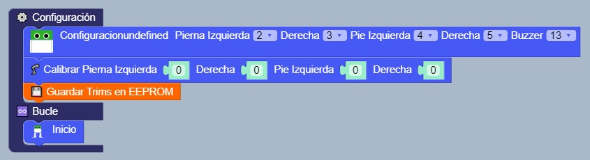

# Montaje

Antes de nada debemos montar el sistema a la Arduino NANO (solo motores). Este proceso es la calibración de los servos, necesitaras instalar Otto Blockly (disponible solo para windows), la aplicación de Otto DIY para que puedas programar tu robot facilmente.

<figure><figcaption></figcaption></figure>

Para montar el robot OTTO debemos introducir las piezas blancas de los servos en los huecos de los pies y las piernas y ponerle los palillos.
